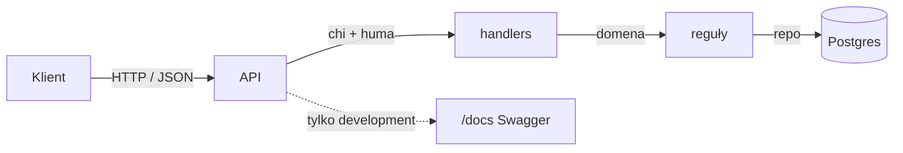

<p align="center">
  <a href="https://go.dev/"></a>
  &nbsp;&nbsp;
  <a href="https://www.postgresql.org/"></a>
  &nbsp;&nbsp;
  <a href="https://www.docker.com/"></a>
  &nbsp;&nbsp;
  <a href="https://www.openapis.org/"></a>
</p>

<h1 align="center">Multi-tenant Go Service</h1>

<p align="center"></p>

<p align="center">
  
  
  
  
  
</p>

<p align="center">
  <a href="#stos">Stos</a>
  ·
  <a href="#szablon">Szablon</a>
  ·
  <a href="#dokumentacja">Dokumentacja</a>
  ·
  <a href="#uruchomienie">Uruchomienie</a>
  ·
  <a href="#polecenia">Polecenia</a>
</p>

---

Szablon serwisu HTTP: chi na routerze, huma na operacjach i OpenAPI, GORM nad pgx do Postgresa, Atlas do migracji. Granice między warstwami — huma tylko w `internal/api`, gorm tylko w `internal/store` — pilnuje test, nie recenzja.

Szczegóły, decyzje i instrukcje: [`docs/`](docs/README.md).

## Stos

<p align="center">
  <a href="https://go.dev/"></a>
  <a href="https://github.com/go-chi/chi"></a>
  <a href="https://huma.rocks/"></a>
  <a href="https://gorm.io/"></a>
  <a href="https://www.postgresql.org/"></a>
  <a href="https://atlasgo.io/"></a>
  <a href="https://docs.docker.com/compose/"></a>
  <a href="https://taskfile.dev/"></a>
  <a href="https://golangci-lint.run/"></a>
</p>

Czego świadomie **nie ma** (JWT-lib, testify, AutoMigrate) i dlaczego: [stack](docs/design/001_technology_stack.md).



## Szablon

Z tego repozytorium powstaje nowy projekt przez [`gonew`](https://pkg.go.dev/golang.org/x/tools/cmd/gonew):

```bash
go install golang.org/x/tools/cmd/gonew@latest

GOPROXY=direct gonew github.com/wokacz/multi-tenant-go-service@latest example.com/app
cd app
```

`example.com/app` to ścieżka modułu nowego projektu — podmień na własną.

## Dokumentacja

| | |
|---|---|
| [Architektura](docs/design/002_architecture.md) | warstwy, kierunek zależności, granice pilnowane testem |
| [Kontrakt API](docs/design/003_api_contract.md) | wersjonowanie, generowane OpenAPI, DTO |
| [Autoryzacja](docs/design/007_authorization.md) | role, uprawnienia, organizacje, audyt |
| [Środowisko](docs/guides/001_development_environment.md) | pierwsze uruchomienie, obie ścieżki, konfiguracja |
| [Nowy endpoint](docs/guides/002_add_endpoint.md) | lista kontrolna najczęstszej zmiany |

Pełny spis: [`docs/README.md`](docs/README.md).

Sam kontrakt HTTP to [`api/openapi.yaml`](api/openapi.yaml) — generowany z handlerów i **commitowany**, więc zmiana widać w diffie, a nie jako skutek uboczny. W developmencie jest też na `/docs` (Swagger UI), `/openapi.json` i `/openapi.yaml`. Produkcja nie serwuje żadnego z nich.

## Uruchomienie

Dwie równorzędne drogi, ten sam `.env`. Szczegóły: [instrukcja środowiska](docs/guides/001_development_environment.md).

<table>
<tr>
<td width="50%">

**Kontenery** — Docker i Task

```bash
cp .env.example .env
task up
```

Postgres, migracje, API z hot-reloadem.

</td>
<td width="50%">

**Host** — Go, Task, Atlas, Docker

```bash
cp .env.example .env
task up -- postgres
task migrate
task run
```

Szybszy cykl edycja–kompilacja.

</td>
</tr>
</table>

**Nie uruchamiaj obu naraz na porcie 8000.** Kontener wygląda na zdrowy (healthcheck sprawdza go od środka), a żądania z hosta trafiają do procesu, który zajął port pierwszy.

```bash
curl -s http://127.0.0.1:8000/health
open http://127.0.0.1:8000/docs
```

### Wymagania

| Narzędzie | Po co |
|---|---|
| [Docker](https://www.docker.com/) | stos Compose albo sam Postgres |
| [Go](https://go.dev/) 1.26+ | kompilator (host, `task check`) |
| [Task](https://taskfile.dev/) | wszystkie polecenia projektu |
| [Atlas](https://atlasgo.io/) | migracje (host, `task migrate:diff`) |
| [golangci-lint](https://golangci-lint.run/) **v2** | lint (`task check`) |

```bash
brew install go
brew install go-task/tap/go-task
brew install ariga/tap/atlas
brew install golangci-lint
```

> **Pułapka.** `.golangci.yml` używa schematu v2. `go install` **musi** iść ze ścieżki `/v2/` — stara po cichu wciąga v1, który tej konfiguracji nie przeczyta:
>
> ```bash
> go install github.com/golangci/golangci-lint/v2/cmd/golangci-lint@latest
> ```

### Pierwszy administrator

Świeża instalacja nie ma nikogo z uprawnieniami. Zarejestruj konto, potem nadaj mu rolę właściciela:

```bash
task bootstrap -- -email you@example.com
# albo, bez Go na hoście:
task compose:bootstrap -- -email you@example.com
```

Dlaczego to krok wdrożeniowy, a nie „pierwszy zarejestrowany wygrywa”: [autoryzacja](docs/design/007_authorization.md#bootstrap).

## Polecenia

`task check` to dokładnie to, co robi CI. `task --list` pokazuje resztę.

```bash
task up              # cały stos w kontenerach
task down            # zatrzymaj (dane zostają)
task check           # tidy + lint + test + openapi:check
task test            # go test ./... -race
task run             # API na hoście
task migrate         # migracje (Atlas na hoście)
task compose:migrate # migracje (obraz Atlasa)
```

Testy domyślnie **nie potrzebują bazy**. Testy repozytoriów pomijają się, dopóki nie ustawisz `POSTGRES_TEST=1`. CI odpala je na kontenerze usługowym — SQL jest sprawdzany przy każdym pushu.

---

<p align="center">
  <sub>MIT · <a href="LICENSE">licencja</a> · dokumentacja w <a href="docs/README.md"><code>docs/</code></a></sub>
</p>
