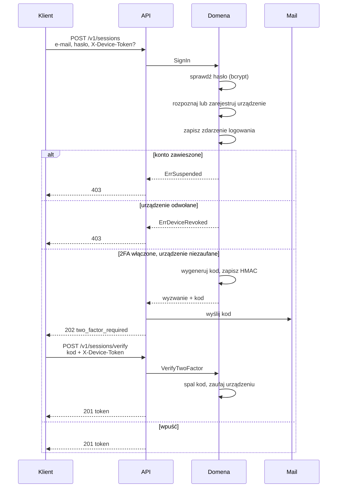

# Uwierzytelnianie

Odpowiada na pytanie **„kim jesteś"**. Co wolno, rozstrzyga się osobno — patrz [Autoryzacja](007_authorization.md).

```
hasło  ──▶  urządzenie  ──▶  [ kod z maila ]  ──▶  token
```

## Logowanie krok po kroku



## Token

Kompaktowy JWT podpisany HMAC-SHA256, bez biblioteki — parser w `internal/auth/token.go`.

| Claim         | Znaczenie                                                |
|---------------|----------------------------------------------------------|
| `sub`         | identyfikator użytkownika                                |
| `did`         | identyfikator **urządzenia**, dla którego token wydano   |
| `ver`         | **epoka sesji** w chwili wydania                         |
| `exp` / `iat` | wygaśnięcie i moment wydania                             |
| `iss` / `aud` | nazwa **tej instalacji**; oba sprawdzane przy parsowaniu |

`iss` i `aud` niosą dziś ten sam napis (`AUTH_TOKEN_ISSUER`, domyślnie
`multi-tenant-go-service`) i to nie jest przeoczenie: jest jedna usługa, więc ten, kto podpisał token, jest zarazem
jedyną stroną, która ma go przyjmować. Oba są zapisywane i oba sprawdzane, więc w dniu, w którym pojawi się druga
usługa, **odbiorca** jest tym, co się rozdzieli.

Powód jest praktyczny: **staging i produkcja skonfigurowane z tego samego pliku sekretów** to nie hipoteza, a bez tych
claimów token stagingowy jest tokenem produkcyjnym — podpis się zgadza, bo sekret jest ten sam.

Token **bez** `iss`/`aud` jest odrzucany, bez okresu przejściowego. Tolerowanie go przez jedno `AUTH_TOKEN_TTL`
znaczyłoby, że weryfikacja jest w tym czasie opcjonalna, i zostawiałoby ścieżkę kodu, której nikt nie usuwa. Koszt:
wszystkie sesje padają raz, czyli jedno zalogowanie.

Konfiguracja: `AUTH_TOKEN_SECRET` (min. 32 bajty) i `AUTH_TOKEN_TTL` (domyślnie
`1h`, format czasu Go — gołe `30` jest odrzucane, nie zgadywane). Produkcja nie wystartuje z sekretem deweloperskim ani
bez własnego.

**Token nie niesie uprawnień.** To świadoma decyzja i jej uzasadnienie jest w
[Autoryzacji](007_authorization.md).

### Kolejność weryfikacji ma znaczenie

`Parse` **najpierw sprawdza podpis**, dopiero potem czyta nagłówek JOSE. To jest to, co zamyka atak `alg=none`: token z
podmienionym algorytmem nie przechodzi podpisu, więc jego treść nigdy nie jest interpretowana.

Podpis liczony jest z dokładnie tych bajtów, które przyszły — nie z ponownie zserializowanej postaci. Inaczej różnica w
kolejności pól albo w białych znakach dawałaby dwa różne teksty pod jednym podpisem.

Każda ścieżka błędu zwraca ten sam `ErrInvalidToken`. Rozróżnianie „uszkodzony"
od „wygasły" od „zły podpis" pozwoliłoby badać weryfikator własność po własności.

## Epoka sesji

`users.session_epoch` to licznik kopiowany do tokenu przy wydaniu. Reset hasła, zmiana hasła w sesji i zawieszenie konta
zwiększają go w tej samej instrukcji, w której zapisują zmianę — nie ma chwili, w której nowe hasło już obowiązuje, a
tokeny wydane pod starym jeszcze działają. `DELETE /v1/me/sessions` podbija samą epokę i nic więcej.

Inkrementacja jest **wyrażeniem SQL**, nie odczytem i zapisem: dwie równoległe zmiany, które odczytają 4, obie
zapisałyby 5, a token wydany pod 4 przeżyłby jedną z nich.

Token wydany wcześniej ma starą epokę, więc przy kolejnym żądaniu odpada — mimo poprawnego podpisu i ważnego `exp`. Daje
to unieważnianie **bez listy odwołań**, której trzeba by pilnować i czyścić.

## Co unieważnia co

| Zdarzenie              | Skutek                                                                 |
|------------------------|------------------------------------------------------------------------|
| Reset hasła            | padają **wszystkie** sesje konta (epoka +1)                            |
| Zmiana hasła w sesji   | to samo — łącznie z sesją, która o zmianę poprosiła                    |
| „Wyloguj wszędzie"     | to samo, bez ruszania hasła                                            |
| Zawieszenie konta      | padają wszystkie sesje, a nowe logowanie jest odrzucane                |
| Odwołanie urządzenia   | padają sesje **tego urządzenia**                                       |
| Wygaśnięcie            | pada pojedynczy token po `AUTH_TOKEN_TTL`                              |
| Zmiana adresu          | **nic** — patrz [niżej](#zmiana-adresu-wymaga-dowodu-z-nowej-skrzynki) |
| Zmiana `name`/`locale` | **nic** — to nie są dane uwierzytelniające                             |

## Zmiana hasła i „wyloguj wszędzie"

| Operacja         | Ścieżka                  | Wymaga               |
|------------------|--------------------------|----------------------|
| zmiana hasła     | `POST /v1/me/password`   | **aktualnego hasła** |
| wyloguj wszędzie | `DELETE /v1/me/sessions` | tylko tokenu         |

Do niedawna hasło można było zmienić **tylko przez reset**, czyli mając dostęp do skrzynki. Podbicie epoki też istniało
wyłącznie jako efekt uboczny resetu albo zawieszenia — a chęć zakończenia sesji bez zmiany hasła, któremu się dalej ufa,
jest przypadkiem zwykłym: sesja została otwarta na maszynie, której się już nie ma.

**Aktualne hasło jest wymagane** z tego samego powodu, dla którego wymaga go zmiana adresu i przełącznik drugiego
składnika: token, który wyciekł z przeglądarki, nie może wystarczyć do zmiany, która **odcina właściciela od własnego
konta**.

**Sesja wołającego też pada.** To wynika z podbicia epoki i jest zamierzone, nie ograniczeniem. Kto zmienia hasło, albo
sądzi, że ktoś je znał — wtedy powinny paść wszystkie sesje — albo nie, i wtedy ponowne zalogowanie kosztuje jeden
ekran. Utrzymanie tej sesji wymagałoby **wydania tokenu w tym miejscu**, a token wydaje ten endpoint, który rozstrzyga,
czy potrzebny jest drugi składnik.

**Nie ma reguły „nowe hasło musi różnić się od starego".** Kosztuje drugie porównanie bcrypt i nic nie chroni: kto
wpisze to samo hasło, właśnie dowiódł, że je zna, a epoka i tak kończy pozostałe sesje — czyli to, po co przyszedł.

**Urządzenia zostają.** `DELETE /v1/me/sessions` kończy sesje; prawo urządzenia do trzymania sesji odbiera
`DELETE /v1/me/devices/{id}`. Pod tą ścieżką **nie ma czego listować** — sesje to tokeny, a `session_epoch` jest jedynym
stanem, jaki po nich zostaje.

`POST /v1/me/password` dzieli budżet limitera z resetem hasła: aktualne hasło jest sekretem, który da się tu zgadywać
uwierzytelnionym tokenem.

## Co sprawdza `requireBearer`

Przy **każdym** żądaniu, po kolei — pierwsze niepowodzenie kończy się `401`:

1. operacja nie jest na liście publicznych,
2. nagłówek `Authorization: Bearer …` istnieje,
3. podpis HMAC się zgadza, nagłówek JOSE to `HS256`,
4. token nie wygasł,
5. użytkownik istnieje,
6. **epoka sesji** w tokenie zgadza się z tą w bazie,
7. konto **nie jest zawieszone**,
8. **urządzenie** z tokenu istnieje i nie jest odwołane.

Punkty 6–8 to zapytania do bazy na żądanie. To świadomy koszt: bez nich „zmień hasło", „zablokuj konto" i „odwołaj
urządzenie" byłyby obietnicami spełnianymi dopiero po wygaśnięciu tokenu.

Middleware wkłada tu na kontekst sesję oraz `audit.Actor` — jedyne miejsce, które ma jednocześnie tożsamość i adres
klienta.

## Domyślnie odmawiaj

`requireBearer` uwierzytelnia **każdą** operację, której identyfikatora nie ma na jawnej liście `publicOperations` w
`internal/api/middleware.go`:

```
health                    create-session          request-password-reset
create-user               verify-session          confirm-password-reset
```

Kuszący wariant — czytać blok `Security` operacji i przepuszczać te bez niego — zawodzi w złą stronę: trasa dodana bez
`Security` byłaby po cichu publiczna i żaden test, który o tym nie wie, by tego nie wyłapał. Tutaj pomyłka idzie w drugą
stronę: zapomniana operacja staje się nieosiągalna, co widać od razu.

`TestEveryOperationIsClassified` sprawdza, że lista i bloki `Security` w specyfikacji zgadzają się **w obie strony**,
żeby generowane klienty nie kłamały.

Odpowiedź `401` niesie `WWW-Authenticate: Bearer realm="…"`, jak wymaga RFC 7235.

## Reset hasła

```
POST /v1/password-resets            { "email" }
POST /v1/password-resets/confirm    { "email", "code", "password", "password_confirm" }
```

Mechanika kodu jest wspólna z drugim składnikiem — opisana w
[Urządzenia i drugi składnik](006_devices_and_2fa.md#wspólna-mechanika-kodów).

### Prośba zawsze kończy się `204`

Nieznany adres, awaria bazy, awaria SMTP — zawsze `204`. Gdyby błąd zapisu zwracał `500`, robiłby to **tylko dla
zarejestrowanych adresów**, czyli byłby dokładnie tym oraklem, który wspólna odpowiedź ma zamykać. Awarie trafiają do
logu.

W developmencie bez skonfigurowanego SMTP log procesu zapisuje, że kod **został poproszony**, nigdy samego kodu. Kod
idzie na stderr tylko gdy stderr jest TTY albo `MAIL_LOG_CODES=1` — aggregator logów nie powinien zobaczyć go przez
przypadek.

### Potwierdzenie unieważnia sesje

`ConsumePasswordReset` w **jednej transakcji** zapisuje nowy hash, zwiększa
`session_epoch` i oznacza kod jako spalony. Awaria w połowie nie może zostawić spalonego kodu przy starym haśle.

## Zmiana adresu wymaga dowodu z nowej skrzynki

`POST /v1/me/email` → kod na **nowy** adres. `POST /v1/me/email/verify` → adres zostaje zastosowany.

Konto nie rusza się, dopóki kod nie wróci. Adres jest tym, na co idzie reset hasła, więc zastosowanie go na samo żądanie
zamieniłoby tę operację w sposób przejęcia konta pożyczonym tokenem. Wymagane jest też **aktualne hasło** — z tego
samego powodu, dla którego wymaga go przełącznik drugiego składnika: token, który wyciekł z przeglądarki, nie może
wystarczyć do przekierowania miejsca, z którego konto się odzyskuje.

**Czy nowy adres jest już zajęty — nie jest ujawniane przy żądaniu.** Uwierzytelniony wołający mógłby inaczej przejść
listę adresów po jednym żądaniu, czyli odtworzyć oracle, który rejestracja zamyka. Odpowiedź jest, ale dopiero przy
potwierdzeniu (`409 email_taken`) — a wtedy wołający przeczytał już kod z tej skrzynki, więc dowiedział się czegoś, co i
tak było w jego zasięgu. To jedyne miejsce, w którym `ErrEmailTaken` wychodzi na zewnątrz; rejestracja przechwytuje go w
handlerze i odpowiada `204`.

**Epoka sesji nie jest podbijana.** Hasło się nie zmieniło, więc istniejące sesje nie są mniej uprawnione niż chwilę
wcześniej, a wylogowanie wszystkich urządzeń przy zmianie profilu jest zaskoczeniem bez zysku. Tę operację chroni hasło
na wejściu i kod z nowej skrzynki na wyjściu.

Kod jest sześciocyfrowy, żyje 15 minut i ma limit 5 prób — tak jak reset. Hash jest liczony z **osobnym `purpose`**
(`email-change`), więc kodu resetu nie da się wydać jako kodu potwierdzającego ani odwrotnie.

