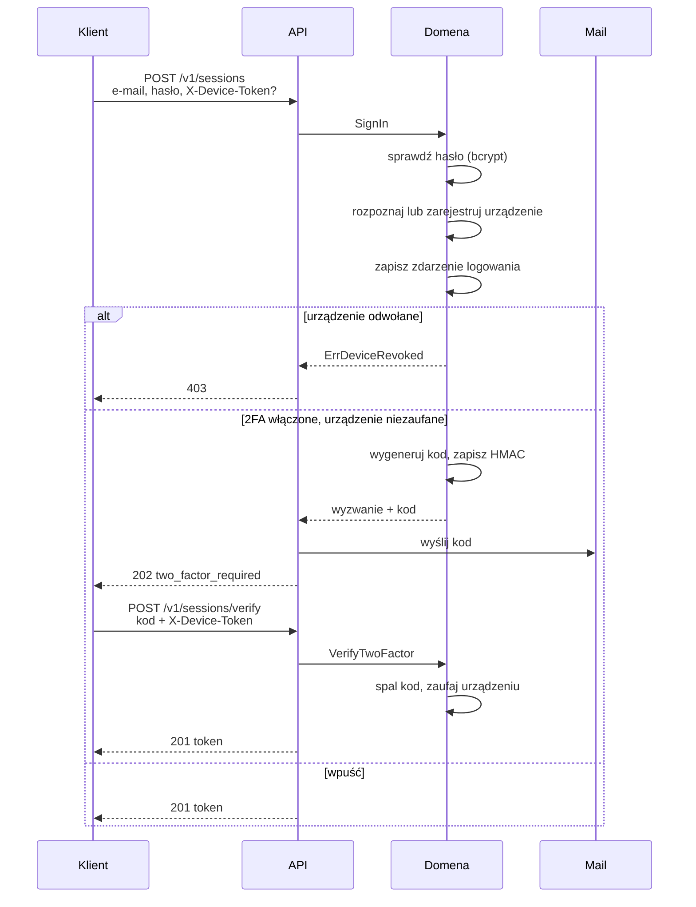

# Przegląd

## Gdzie co się dzieje

Autoryzacja przecina wszystkie warstwy, ale każda odpowiada za co innego.

| Warstwa | Pakiet | Odpowiedzialność |
| --- | --- | --- |
| Transport | `internal/api` | Wyciąga nagłówek `Authorization`, weryfikuje token, decyduje o statusie HTTP |
| Kryptografia | `internal/auth` | Podpisuje i weryfikuje JWT. Nie wie nic o HTTP ani o bazie |
| Reguły | `internal/domain/user` | Decyduje, kto dostaje token, kiedy potrzebny jest drugi składnik |
| Trwałość | `internal/store` | Tłumaczy błędy sterownika na błędy domenowe. Tu kończy się GORM |

Zależności idą **do środka**. Test w `internal/architecture_test.go` przewraca
build, jeśli huma wycieknie poza `internal/api`, a GORM poza `internal/store`.

## Logowanie krok po kroku



## Każde kolejne żądanie

Middleware `requireBearer` sprawdza po kolei — pierwsze niepowodzenie kończy
się `401`:

1. Operacja nie jest na liście publicznych.
2. Nagłówek `Authorization: Bearer …` istnieje.
3. Podpis HMAC się zgadza, nagłówek JOSE to `HS256`.
4. Token nie wygasł.
5. Użytkownik istnieje.
6. **Epoka sesji** w tokenie zgadza się z tą w bazie.
7. **Urządzenie** z tokenu istnieje i nie jest odwołane.

Punkty 6 i 7 to dwa zapytania do bazy na żądanie. To świadomy koszt: bez nich
„zmień hasło" i „odwołaj urządzenie" byłyby obietnicami spełnianymi dopiero po
wygaśnięciu tokenu.

## Błąd zmienia słownictwo dokładnie dwa razy

```
sterownik  ──▶  błąd domenowy  ──▶  status HTTP
           repo               problem
```

1. **Repozytorium** zamienia błąd GORM na domenowy
   (`gorm.ErrDuplicatedKey` → `user.ErrEmailTaken`).
2. **`internal/api/problem`** zamienia domenowy na status HTTP.

Cokolwiek niezmapowanego staje się nieprzejrzystym `500`, a prawdziwy błąd
trafia do logu przy identyfikatorze żądania. Surowe błędy niosą nazwy tabel i
fragmenty zapytań — to nie należy do odpowiedzi.

| Błąd domenowy | Status |
| --- | --- |
| `ErrInvalidCredentials`, `ErrInvalidResetCode`, `ErrInvalidTwoFactorCode`, `ErrUnauthorized` | `401` |
| `ErrDeviceRevoked` | `403` |
| `ErrNotFound` | `404` |
| `ErrPasswordTooShort`, `ErrPasswordMismatch`, `ErrNameEmpty`, … | `422` |

Wszystkie odpowiedzi błędne to `application/problem+json` (RFC 7807) — łącznie
z tymi, które generuje router przed huma, i z odpowiedzią po panice.
